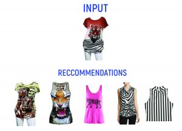
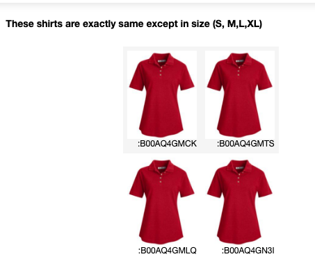
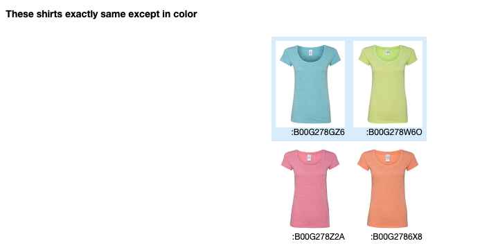
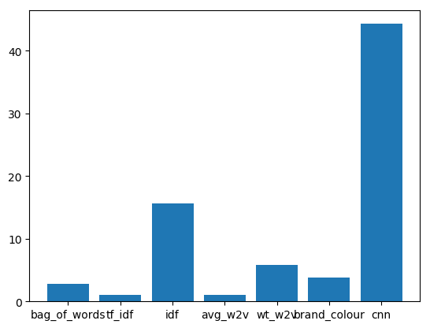
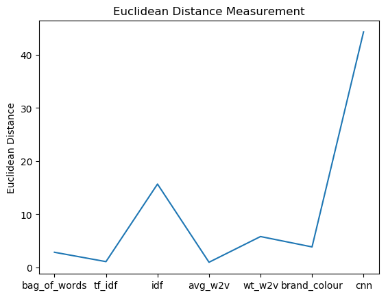

# Apparel_Product_Recommendation

Extracts apparel details from amazon api and recommends similar products using nltk and keras <br>
<p align="center">  </p>
<br>

## OVERVIEW
Personalized product recommendations are the alternative way of navigating through the online shop. More people find products they need. Even if they didn’t think of them. Build a recommendation engine which suggests similar products to the given product in any e-commerce websites ex. Amazon.com, myntra.com etc.
<br> In this project we used Amazon’s Product Advertising API to obtain the data in a policy complaint manner, and we acquired data for 1,83,000 products.For each product we obtained Image-url, Title, price etc.For this project we primarily focussed on Women’s Apparel data. Amazon’s Product Advertising API can be used to extract data for other products as well.
## PROBLEM STATEMENT
Given a json file for extracting the 180k apparel images from amazon.com we need to recommend the similar apparel based on the document id i.e product id and number of apparels to be recommended at a time.
Each of those images will be recommended based on following fields:
```
1. asin  ( Amazon standard identification number)
2. brand ( brand to which the product belongs to )
3. color ( Color information of apparel, it can contain many colors as   a value ex: red and black stripes ) 
4. product_type_name (type of the apperal, ex: SHIRT/TSHIRT )
5. medium_image_url  ( url of the image )
6. title (title of the product.)
7. formatted_price (price of the product)
```
### Data Preprocessing
* We remove all those data points in which any of the attribute information is missing.
* Remove near duplicates item : <br>
<p float="left">


</p>

* Removed the duplicates which differ only at the end.
* Text-Preprocessing : Stop words removal

We are going to use a total of `seven approaches` for recommending the apparel as following.
```
1.Bag of words model
2.tf-idf model
3.idf model
4.word2vec model
5.idf weighted word2vec model
6.weighted similarity using brand and color
7.visual features based using convolution neural networks
```

## Software Requirments

* Install 
	* [Anaconda](https://www.anaconda.com/download/#linux) with following extra packages
	* [tensorflow](https://www.tensorflow.org/)
	* [plotly](https://plot.ly/)
	* [PIL](https://pillow.readthedocs.io/en/5.2.x/)
* GPU for training the [Convolution neural networks model](https://en.wikipedia.org/wiki/Convolutional_neural_network) and [word2vec model](https://en.wikipedia.org/wiki/Word2vec).

## Observation
* We trained the seven models and recommended similar top 20 apparels with the least [euclidean distance](https://en.wikipedia.org/wiki/Euclidean_distance) for each model.
* We calculated the average euclidean distance for each model by taking the mean and compared them using the line plot and bar graph
## Result
We found that the order of the best recommendation performance is as follows 
```
1.TF-IDF
2.AVERAGE WORD2VEC
3.BAG OF WORDS
4.BRAND AND COLOR
5.WEIGHTED WORD2VEC
6.IDF
7.CNN
```

<p float="left">


<p>
